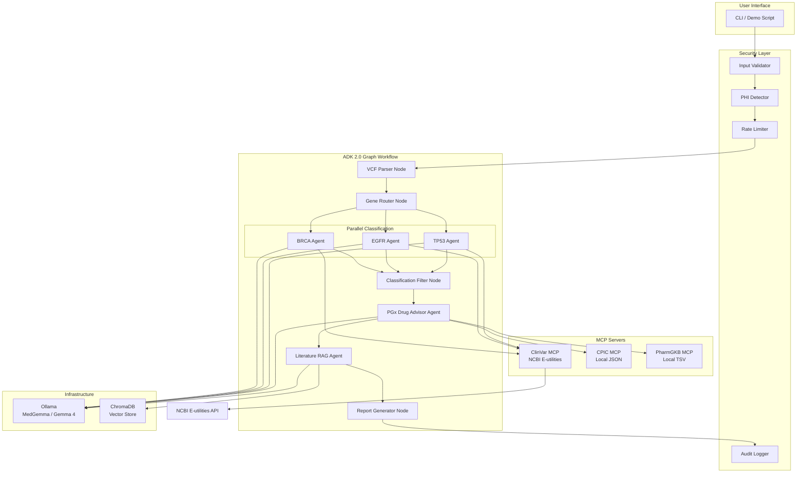
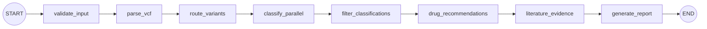
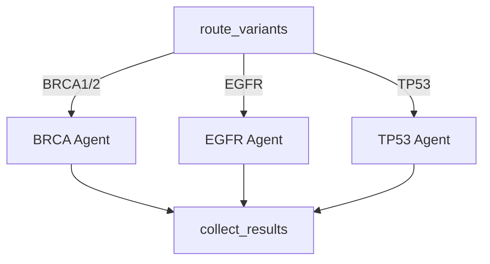

# Design Document: PharmaGenomics Advisor

## Overview

PharmaGenomics Advisor is a multi-agent precision medicine pipeline that processes VCF (Variant Call Format) files through a sequence of specialized AI agents to produce clinically actionable pharmacogenomics reports. The system uses Google ADK 2.0 graph-based workflows for orchestration, FastMCP servers for external knowledge base access (ClinVar, CPIC, PharmGKB), Ollama for local LLM inference, and ChromaDB for literature retrieval via RAG.

The pipeline follows a deterministic graph workflow: VCF parsing → gene-specific variant classification → pharmacogenomics drug recommendation → literature evidence retrieval → clinical report generation. Each stage is implemented as a discrete workflow node, enabling graceful degradation when external services are unavailable.

### Key Design Decisions

| Decision | Choice | Rationale |
|----------|--------|-----------|
| Orchestration | ADK 2.0 `Workflow` graph API | Deterministic node execution with branching, parallel dispatch, and typed data passing between nodes |
| MCP Framework | FastMCP 2.0 | Pythonic decorator-based tool definition, handles MCP wire protocol automatically |
| LLM Runtime | Ollama (localhost) | Zero API keys, local-first, reproducible inference, privacy-preserving |
| LLM Model | MedGemma 4B / Gemma 4 12B | Medical domain specialization / strong function calling |
| Vector Store | ChromaDB (persistent) | Local embedded database, cosine similarity search, no server process needed |
| Embeddings | all-MiniLM-L6-v2 | 384-dim, fast, good quality for biomedical text |
| Data Models | Pydantic v2 | Runtime validation, JSON serialization, schema generation |
| Security | Layered middleware | Input validation → PHI detection → rate limiting → audit logging |

## Architecture

### High-Level System Diagram



### ADK 2.0 Graph Workflow Design

The pipeline is structured as a `Workflow` instance using ADK 2.0's graph-based execution engine. Each node is either a deterministic function or an LLM-powered `Agent`:



**Node Types:**
- **Deterministic nodes** (no LLM): `validate_input`, `parse_vcf`, `route_variants`, `filter_classifications`, `generate_report`
- **LLM Agent nodes**: `classify_parallel` (dispatches to BRCA/EGFR/TP53 agents), `drug_recommendations` (PGx Advisor), `literature_evidence` (RAG Agent)

### Parallel Dispatch Pattern

The variant classification step uses ADK 2.0's parallel execution capability via `asyncio.gather`:



Each agent call has a 60-second timeout with one retry on failure.

## Components and Interfaces

### 1. VCF Parser (`src/parsers/vcf_parser.py`)

Pure deterministic code — no LLM involved.

```python
class VCFParser:
    """Parse VCF 4.x files into structured Variant objects."""
    
    MAX_VARIANTS: int = 10_000
    SUPPORTED_GENES: set[str] = {"BRCA1", "BRCA2", "EGFR", "TP53"}
    
    def parse(self, file_path: Path) -> ParseResult:
        """Parse VCF file, returning variants and metadata.
        
        Raises:
            VCFFormatError: Malformed file with field name and line number
            VCFEmptyError: No variant records found
            VCFTooLargeError: Exceeds MAX_VARIANTS limit
        """
        ...
    
    def format_variant(self, variant: Variant) -> str:
        """Convert Variant back to VCF record string (round-trip support)."""
        ...
    
    def parse_line(self, line: str, line_num: int) -> Variant:
        """Parse a single VCF record line."""
        ...
```

### 2. Security Layer (`src/security/`)

Middleware chain applied before any data enters the pipeline.

```python
class SecurityLayer:
    """Composable security middleware chain."""
    
    def __init__(self, config: SecurityConfig):
        self.input_validator = InputValidator(config.injection_patterns)
        self.phi_detector = PHIDetector(config.phi_enabled)
        self.rate_limiter = RateLimiter(max_requests=100, window_seconds=60)
        self.audit_logger = AuditLogger(config.audit_log_path)
    
    async def validate(self, input_data: str, session_id: str) -> ValidationResult:
        """Run all security checks. Returns ValidationResult with pass/fail and reason."""
        ...

class AuditLogger:
    """Append-only audit log with SHA-256 hashing."""
    
    def log(self, agent_name: str, action: str, input_data: str, output_data: str) -> None:
        """Write immutable audit record with ISO 8601 timestamp."""
        ...
```

### 3. Supervisor / Graph Workflow (`src/pipeline/graph.py`)

```python
from google.adk import Workflow, Agent, Event

# Deterministic nodes
def validate_and_parse(vcf_content: str) -> ParseResult: ...
def route_variants(parse_result: ParseResult) -> RoutingResult: ...
def filter_actionable(classifications: list[VariantClassification]) -> FilterResult: ...
def assemble_report(pipeline_state: PipelineState) -> ClinicalReport: ...

# Agent nodes
brca_agent = Agent(
    name="brca_agent",
    model="ollama/medgemma",
    instruction="...",
    tools=[clinvar_mcp_tool],
    output_schema=VariantClassification,
)

# Graph definition
pipeline = Workflow(
    name="pharmagenomics_pipeline",
    edges=[
        ("START", validate_and_parse, route_variants, classify_parallel),
        (classify_parallel, filter_actionable, drug_recommendation_agent),
        (drug_recommendation_agent, literature_rag_agent, assemble_report),
    ],
)
```

### 4. Gene-Specific Agents (`agents/brca_agent/`, `agents/egfr_agent/`, `agents/tp53_agent/`)

Each agent follows a common interface but has gene-specialized system prompts:

```python
class GeneAgentInterface(Protocol):
    """Common interface for all gene-specific classification agents."""
    
    async def classify(self, variant: Variant) -> VariantClassification:
        """Classify variant using ACMG/AMP 5-tier criteria.
        
        Steps:
        1. Query ClinVar MCP for existing clinical significance
        2. Apply gene-specific ACMG criteria via LLM reasoning
        3. Return structured classification with confidence and evidence
        """
        ...
```

**EGFR Agent** additionally annotates `therapeutic_relevance`: "TKI-sensitive" | "TKI-resistant" | "unknown therapeutic relevance"

**TP53 Agent** additionally annotates `functional_status`: "gain-of-function" | "loss-of-function" | "undetermined"

### 5. PGx Drug Advisor (`agents/pgx_advisor/`)

```python
class PGxDrugAdvisor:
    """Maps pathogenic/likely pathogenic variants to drug recommendations."""
    
    MAX_RECOMMENDATIONS_PER_VARIANT: int = 10
    
    async def recommend(self, classification: VariantClassification) -> list[DrugRecommendation]:
        """Generate drug recommendations for actionable variants.
        
        Queries CPIC MCP for gene-drug guidelines.
        For EGFR TKI-sensitive variants, also queries PharmGKB MCP.
        Returns up to 10 recommendations ordered by evidence level (strongest first).
        """
        ...
```

### 6. Literature RAG Agent (`agents/literature_rag/`)

```python
class LiteratureRAGAgent:
    """Retrieves and synthesizes biomedical literature evidence."""
    
    TOP_K: int = 5
    MIN_RELEVANCE_SCORE: float = 0.5
    MAX_SYNTHESIS_WORDS: int = 200
    
    async def retrieve_evidence(
        self, variant: str, drug: str
    ) -> LiteratureResult:
        """Search vector store for relevant papers, generate synthesis.
        
        Returns top 5 papers (score >= 0.5) with citation metadata.
        Generates ≤200 word synthesis paragraph via LLM.
        """
        ...
```

### 7. MCP Servers (`mcp_servers/`)

Built with FastMCP 2.0:

```python
# mcp_servers/clinvar_server.py
from fastmcp import FastMCP

mcp = FastMCP("clinvar-server")

@mcp.tool()
async def clinvar_variant_lookup(
    gene: str, chromosome: str, position: int, ref: str, alt: str
) -> dict:
    """Query ClinVar for variant clinical significance via NCBI E-utilities.
    Timeout: 30 seconds. Returns clinical significance, review status, submission count.
    """
    ...

# mcp_servers/cpic_server.py
@mcp.tool()
async def cpic_gene_drug_guidelines(gene: str) -> dict:
    """Get CPIC gene-drug interaction guidelines from local JSON cache.
    Returns recommendation strength and phenotype-based dosing.
    """
    ...

# mcp_servers/pharmgkb_server.py
@mcp.tool()
async def pharmgkb_annotations(gene: str) -> dict:
    """Get PharmGKB clinical annotations from local TSV cache.
    Returns evidence level, drug associations, phenotype categories.
    """
    ...
```

### 8. Clinical Report Generator (`src/pipeline/report.py`)

```python
class ReportGenerator:
    """Assembles sub-agent outputs into unified clinical report."""
    
    MAX_MARKDOWN_WORDS: int = 1000
    
    def generate(self, pipeline_state: PipelineState) -> ClinicalReport:
        """Produce JSON + Markdown clinical report with provenance metadata."""
        ...
    
    def to_json(self, report: ClinicalReport) -> str:
        """Serialize to JSON (round-trip safe)."""
        ...
    
    def from_json(self, json_str: str) -> ClinicalReport:
        """Deserialize from JSON."""
        ...
    
    def to_markdown(self, report: ClinicalReport) -> str:
        """Generate human-readable markdown summary (≤1000 words)."""
        ...
```

## Data Models

All models use Pydantic v2 for runtime validation and JSON schema generation.

```python
from pydantic import BaseModel, Field
from enum import Enum
from datetime import datetime
from typing import Optional


# ─── Enums ───────────────────────────────────────────────────────────────

class ACMGClassification(str, Enum):
    PATHOGENIC = "Pathogenic"
    LIKELY_PATHOGENIC = "Likely Pathogenic"
    VUS = "VUS"
    LIKELY_BENIGN = "Likely Benign"
    BENIGN = "Benign"


class ConfidenceLevel(str, Enum):
    HIGH = "High"
    MODERATE = "Moderate"
    LOW = "Low"


class TherapeuticRelevance(str, Enum):
    TKI_SENSITIVE = "TKI-sensitive"
    TKI_RESISTANT = "TKI-resistant"
    UNKNOWN = "unknown therapeutic relevance"


class FunctionalStatus(str, Enum):
    GAIN_OF_FUNCTION = "gain-of-function"
    LOSS_OF_FUNCTION = "loss-of-function"
    UNDETERMINED = "undetermined"


class RouteStatus(str, Enum):
    ROUTED = "routed"
    UNROUTED = "unrouted"


class RecommendationAction(str, Enum):
    AVOID = "avoid"
    DOSE_ADJUSTMENT = "dose adjustment"
    STANDARD_DOSING = "standard dosing"
    ALTERNATIVE_THERAPY = "alternative therapy"


# ─── Core Data Models ────────────────────────────────────────────────────

class Variant(BaseModel):
    """Parsed VCF variant record."""
    chromosome: str = Field(..., description="e.g., chr17")
    position: int = Field(..., gt=0)
    id: str = Field(default=".")
    ref_allele: str = Field(..., min_length=1, pattern=r"^[ATCGN]+$")
    alt_allele: str = Field(..., min_length=1, pattern=r"^[ATCGN,.]+$")
    quality: float = Field(default=0.0, ge=0.0)
    filter_status: str = Field(default=".")
    info: dict = Field(default_factory=dict)
    gene: Optional[str] = None
    route_status: RouteStatus = RouteStatus.UNROUTED


class ParseResult(BaseModel):
    """Result of VCF file parsing."""
    variants: list[Variant]
    total_count: int
    routed_count: int
    unrouted_count: int
    parse_duration_ms: float


class VariantClassification(BaseModel):
    """ACMG classification result from a gene-specific agent."""
    gene: str
    variant_description: str
    chromosome: str
    position: int
    ref_allele: str
    alt_allele: str
    classification: ACMGClassification
    confidence: ConfidenceLevel
    evidence_references: list[str] = Field(..., min_length=1)
    therapeutic_relevance: Optional[TherapeuticRelevance] = None  # EGFR only
    functional_status: Optional[FunctionalStatus] = None  # TP53 only
    data_sources_queried: list[str] = Field(default_factory=list)
    limitations: list[str] = Field(default_factory=list)


class DrugRecommendation(BaseModel):
    """Pharmacogenomics drug recommendation."""
    drug_name: str
    gene: str
    variant: str
    action: RecommendationAction
    evidence_level: str = Field(..., description="CPIC level: A, B, C, D")
    guideline_source_url: str
    contraindications: list[str] = Field(default_factory=list)


class LiteratureCitation(BaseModel):
    """Retrieved biomedical literature citation."""
    title: str
    authors: str
    journal: str
    year: int
    doi: str
    relevance_score: float = Field(..., ge=0.0, le=1.0)
    evidence_summary: str = Field(..., max_length=500)


class LiteratureResult(BaseModel):
    """Complete literature evidence result."""
    citations: list[LiteratureCitation]
    synthesis_paragraph: str = Field(..., max_length=1500)  # ~200 words
    status: str = Field(default="success")


class ProvenanceMetadata(BaseModel):
    """Provenance tracking for each finding."""
    source_agent: str
    data_sources_queried: list[str]
    confidence: ConfidenceLevel
    timestamp: datetime


class ClinicalReport(BaseModel):
    """Unified clinical report — final pipeline output."""
    report_id: str
    generated_at: datetime
    pipeline_version: str
    total_execution_time_seconds: float
    
    # Content sections
    variant_summary: list[Variant]
    classifications: list[VariantClassification]
    drug_recommendations: list[DrugRecommendation]
    literature_evidence: list[LiteratureResult]
    
    # Metadata
    provenance: list[ProvenanceMetadata]
    warnings: list[dict] = Field(default_factory=list)
    
    # Human-readable summary
    markdown_summary: str = Field(..., max_length=7000)  # ~1000 words


class AuditRecord(BaseModel):
    """Immutable audit log entry."""
    timestamp: datetime
    agent_name: str
    action_type: str
    input_hash: str = Field(..., pattern=r"^[a-f0-9]{64}$")
    output_hash: str = Field(..., pattern=r"^[a-f0-9]{64}$")


# ─── Security Models ─────────────────────────────────────────────────────

class ValidationResult(BaseModel):
    """Result of security validation."""
    is_valid: bool
    error_message: Optional[str] = None
    rejected_reason: Optional[str] = None


class SecurityConfig(BaseModel):
    """Security layer configuration."""
    phi_detection_enabled: bool = True
    clinical_use_mode: bool = False  # Set via env var to allow PHI
    rate_limit_requests: int = 100
    rate_limit_window_seconds: int = 60
    max_input_chars: int = 10_000
    data_persistence_enabled: bool = False  # Set via config flag
    audit_log_path: str = "audit.log"
    ollama_port: int = 11434
```


## Correctness Properties

*A property is a characteristic or behavior that should hold true across all valid executions of a system — essentially, a formal statement about what the system should do. Properties serve as the bridge between human-readable specifications and machine-verifiable correctness guarantees.*

### Property 1: VCF Parse-Format-Parse Round-Trip

*For any* valid VCF record string conforming to VCF 4.x format, parsing it into a `Variant` object, formatting it back to a VCF string, and parsing that string again SHALL produce a `Variant` with identical values for chromosome, position, reference allele, alternate allele, and quality fields.

**Validates: Requirements 1.5, 1.6**

### Property 2: Variant Routing Correctness

*For any* parsed `Variant` object, if the variant's gene annotation is one of {BRCA1, BRCA2, EGFR, TP53}, then `route_status` SHALL be "routed" and the variant SHALL be dispatched to the corresponding gene-specific agent (BRCA_Agent for BRCA1/BRCA2, EGFR_Agent for EGFR, TP53_Agent for TP53); otherwise `route_status` SHALL be "unrouted" and the variant SHALL be excluded from specialized agent dispatch.

**Validates: Requirements 1.2, 1.7, 2.2**

### Property 3: VCF Format Validation Error Reporting

*For any* input that does not conform to VCF 4.x format (wrong number of tab-separated fields, non-numeric position, or missing mandatory columns), the parser SHALL return a `VCFFormatError` whose message contains both the malformed field name and the line number where parsing failed.

**Validates: Requirements 1.3**

### Property 4: Classification Filtering for Drug Recommendation

*For any* set of `VariantClassification` results, only those with `classification` equal to "Pathogenic" or "Likely Pathogenic" SHALL be forwarded to the PGx Drug Advisor; classifications of "VUS", "Likely Benign", or "Benign" SHALL appear in the final report but SHALL NOT be processed for drug recommendations.

**Validates: Requirements 2.3**

### Property 5: Classification Output Validity

*For any* variant submitted to a gene-specific agent, the returned `VariantClassification` SHALL have: (a) `classification` as one of the 5 ACMG tiers, (b) `confidence` as one of {High, Moderate, Low}, (c) at least one non-empty entry in `evidence_references`, (d) for EGFR variants: `therapeutic_relevance` as one of {"TKI-sensitive", "TKI-resistant", "unknown therapeutic relevance"}, and (e) for TP53 variants: `functional_status` as one of {"gain-of-function", "loss-of-function", "undetermined"}.

**Validates: Requirements 3.1, 3.2, 3.3, 3.5**

### Property 6: Gene Mismatch Rejection

*For any* variant whose gene annotation does not match the receiving agent's specialization (e.g., an EGFR variant sent to BRCA_Agent), the agent SHALL reject the request with an error indicating a gene mismatch, and SHALL NOT produce a classification result.

**Validates: Requirements 3.7**

### Property 7: Drug Recommendation Output Structure and Ordering

*For any* set of drug recommendations returned by the PGx Drug Advisor, each recommendation SHALL contain all required fields (drug_name, gene, variant, action, evidence_level, guideline_source_url, contraindications), the total count per variant SHALL NOT exceed 10, and recommendations SHALL be ordered by evidence level from strongest (A) to weakest (D).

**Validates: Requirements 4.2, 4.4**

### Property 8: PharmGKB Query Routing

*For any* `VariantClassification` with gene "EGFR" and `therapeutic_relevance` equal to "TKI-sensitive", the PGx Drug Advisor SHALL query the PharmGKB MCP server for targeted therapy annotations; for all other gene/therapeutic_relevance combinations, PharmGKB SHALL NOT be queried.

**Validates: Requirements 4.3**

### Property 9: Literature Retrieval Filtering and Ranking

*For any* query to the Literature RAG Agent, returned citations SHALL number at most 5, each SHALL have `relevance_score` ≥ 0.5, results SHALL be ordered by relevance score (descending) as primary criterion and publication year (descending, preferring recent) as secondary criterion, and each citation SHALL contain non-empty title, authors, journal, year, DOI, relevance_score, and evidence_summary fields.

**Validates: Requirements 5.1, 5.2, 5.3**

### Property 10: Literature Synthesis Word Limit

*For any* synthesis paragraph generated by the Literature RAG Agent, the word count SHALL NOT exceed 200 words.

**Validates: Requirements 5.5**

### Property 11: MCP Malformed Query Rejection

*For any* query to an MCP server that is missing one or more required fields, the server SHALL return a structured error response indicating which specific parameters are missing, and SHALL NOT attempt to process the query.

**Validates: Requirements 6.7**

### Property 12: MCP Empty Results for No Matches

*For any* valid query to an MCP server where the underlying data source contains no matching records, the server SHALL return an empty results array with a status of "no records found".

**Validates: Requirements 6.9**

### Property 13: Injection Pattern Detection

*For any* input string containing known injection patterns (SQL keywords in query context, prompt injection phrases, or command injection characters), the security layer SHALL reject the input before it reaches any agent or MCP server, returning a validation error indicating the rejection.

**Validates: Requirements 8.1**

### Property 14: PHI Detection and Refusal

*For any* input string containing identifiable patient information (names matching common name patterns, dates of birth in standard date formats, or medical record numbers matching MRN patterns), when clinical use mode is disabled, the security layer SHALL refuse to process the input; when clinical use mode is enabled via environment variable, the same input SHALL be accepted.

**Validates: Requirements 8.2**

### Property 15: Audit Log Completeness

*For any* agent invocation, the audit logger SHALL append a record containing: a valid ISO 8601 timestamp, the agent name, the action type, a 64-character lowercase hex SHA-256 hash of the input, and a 64-character lowercase hex SHA-256 hash of the output.

**Validates: Requirements 8.3**

### Property 16: Input Size Limit Enforcement

*For any* input string whose character count exceeds 10,000, the security layer SHALL reject the input with a size limit error before forwarding to any model or agent.

**Validates: Requirements 8.5**

### Property 17: Rate Limit Enforcement

*For any* session, after 100 requests have been processed within a 60-second window, the next request SHALL be rejected with HTTP 429 status and a retry-after header indicating when the window resets.

**Validates: Requirements 8.6**

### Property 18: Clinical Report JSON Round-Trip

*For any* valid `ClinicalReport` object, serializing it to JSON and deserializing back to a `ClinicalReport` object, then re-serializing to JSON SHALL produce output identical to the first serialization.

**Validates: Requirements 9.5**

### Property 19: Clinical Report Structure Completeness

*For any* completed pipeline run, the generated `ClinicalReport` SHALL contain all required sections (variant_summary, classifications, drug_recommendations, literature_evidence, provenance, generated_at, total_execution_time_seconds), and each entry in provenance SHALL include source_agent, data_sources_queried, confidence, and timestamp fields.

**Validates: Requirements 9.1, 9.3**

### Property 20: Clinical Report Warnings for Degraded Results

*For any* pipeline stage that produced an error or degraded result (timeout, service unavailability, retry failure), the clinical report's warnings section SHALL contain an entry listing the affected finding, its limitation description, and the name of the stage that failed.

**Validates: Requirements 9.4**

### Property 21: Clinical Report Markdown Word Limit

*For any* generated clinical report, the human-readable markdown summary section SHALL NOT exceed 1,000 words.

**Validates: Requirements 9.2**

### Property 22: Unified Report Contains All Sub-Agent Outputs

*For any* set of successfully completed sub-agent results (classifications, drug recommendations, literature evidence), the unified clinical report SHALL contain every result from every sub-agent that completed successfully, with no results dropped or omitted.

**Validates: Requirements 2.6**

## Error Handling

### Cascading Graceful Degradation Strategy

The system implements a 4-level degradation model where failures reduce output quality but never crash the pipeline:

| Level | Condition | Behavior |
|-------|-----------|----------|
| 1 — Full | All services available | Complete report with all evidence |
| 2 — Partial | ClinVar/PharmGKB timeout | Classification/recommendations from local knowledge only, flagged "limited evidence" |
| 3 — Major | Agent timeout (>60s) | One retry, then mark agent result "unavailable", continue with remaining |
| 4 — Critical | Ollama not running | Pipeline refuses to start, displays fix instructions |

### Error Types and Handling

```python
# Custom exception hierarchy
class PipelineError(Exception):
    """Base exception for all pipeline errors."""
    pass

class VCFFormatError(PipelineError):
    """VCF file does not conform to 4.x spec."""
    def __init__(self, field_name: str, line_number: int, message: str): ...

class VCFEmptyError(PipelineError):
    """VCF file contains zero parseable variants."""
    pass

class VCFTooLargeError(PipelineError):
    """VCF file exceeds maximum variant count."""
    def __init__(self, count: int, max_count: int = 10_000): ...

class SecurityValidationError(PipelineError):
    """Input failed security validation."""
    def __init__(self, reason: str, pattern_type: str): ...

class MCPTimeoutError(PipelineError):
    """MCP server did not respond within timeout."""
    def __init__(self, server_name: str, timeout_seconds: float): ...

class AgentTimeoutError(PipelineError):
    """Sub-agent did not respond within timeout."""
    def __init__(self, agent_name: str, timeout_seconds: float): ...

class OllamaUnavailableError(PipelineError):
    """Ollama service is not reachable."""
    def __init__(self, host: str, port: int): ...
```

### Timeout Configuration

| Component | Timeout | Retry | Fallback |
|-----------|---------|-------|----------|
| VCF parsing | 30s (hard limit via file size cap) | No | Reject file |
| ClinVar MCP | 30s | No | Classify with local knowledge + flag |
| CPIC MCP | 30s | No | Use local cache + flag |
| PharmGKB MCP | 30s | No | Use local cache + flag |
| Gene Agent | 60s | 1 retry | Mark "unavailable", continue |
| PGx Advisor | 60s | 1 retry | Mark "unavailable", continue |
| Literature RAG | 15s (vector store) | No | Return "unavailable" + suggest PubMed |
| Ollama startup check | 10s | No | Refuse to start + show instructions |

### Error Propagation Flow

```python
async def classify_with_timeout(agent: Agent, variant: Variant) -> VariantClassification:
    """Classify variant with timeout and retry logic."""
    for attempt in range(2):  # 1 initial + 1 retry
        try:
            result = await asyncio.wait_for(
                agent.classify(variant),
                timeout=60.0
            )
            return result
        except asyncio.TimeoutError:
            if attempt == 0:
                continue  # retry once
            return VariantClassification(
                gene=variant.gene,
                classification=None,
                limitations=["Agent timeout after retry — result unavailable"],
                data_sources_queried=[],
            )
        except Exception as e:
            if attempt == 0:
                continue
            return VariantClassification(
                gene=variant.gene,
                classification=None,
                limitations=[f"Agent error: {str(e)} — result unavailable"],
                data_sources_queried=[],
            )
```

## Testing Strategy

### Dual Testing Approach

The testing strategy combines property-based tests for universal correctness guarantees with example-based unit tests for specific scenarios and integration tests for end-to-end behavior.

### Property-Based Testing (Hypothesis)

**Library:** [Hypothesis](https://hypothesis.readthedocs.io/) for Python

**Configuration:**
- Minimum 100 iterations per property test (via `@settings(max_examples=100)`)
- Each test tagged with feature and property reference
- Tag format: `# Feature: pharmacogenomics-advisor, Property {N}: {title}`

**Property tests target these modules:**
| Module | Properties Tested |
|--------|-------------------|
| `src/parsers/vcf_parser.py` | P1 (round-trip), P2 (routing), P3 (error reporting) |
| `src/pipeline/supervisor.py` | P4 (filtering), P22 (unified report) |
| `agents/*` | P5 (output validity), P6 (gene mismatch) |
| `agents/pgx_advisor/` | P7 (recommendation structure), P8 (PharmGKB routing) |
| `src/rag/` | P9 (retrieval filtering), P10 (synthesis word limit) |
| `mcp_servers/` | P11 (malformed rejection), P12 (empty results) |
| `src/security/` | P13 (injection), P14 (PHI), P15 (audit), P16 (size), P17 (rate limit) |
| `src/pipeline/report.py` | P18 (JSON round-trip), P19 (structure), P20 (warnings), P21 (word limit) |

**Example property test:**

```python
# tests/properties/test_vcf_roundtrip.py
# Feature: pharmacogenomics-advisor, Property 1: VCF Parse-Format-Parse Round-Trip
from hypothesis import given, settings
from hypothesis import strategies as st

@settings(max_examples=100)
@given(
    chrom=st.sampled_from(["chr1", "chr2", "chr7", "chr17", "chrX"]),
    position=st.integers(min_value=1, max_value=300_000_000),
    ref=st.text(alphabet="ATCG", min_size=1, max_size=50),
    alt=st.text(alphabet="ATCG", min_size=1, max_size=50),
    quality=st.floats(min_value=0, max_value=10000, allow_nan=False, allow_infinity=False),
)
def test_vcf_parse_format_parse_roundtrip(chrom, position, ref, alt, quality):
    """Parse → format → parse preserves chromosome, position, ref, alt, quality."""
    vcf_line = f"{chrom}\t{position}\t.\t{ref}\t{alt}\t{quality:.1f}\tPASS\t."
    variant = parse_vcf_line(vcf_line, line_num=1)
    formatted = format_variant_to_vcf(variant)
    reparsed = parse_vcf_line(formatted, line_num=1)
    
    assert reparsed.chromosome == variant.chromosome
    assert reparsed.position == variant.position
    assert reparsed.ref_allele == variant.ref_allele
    assert reparsed.alt_allele == variant.alt_allele
    assert abs(reparsed.quality - variant.quality) < 0.01
```

### Unit Tests (pytest)

Focused on specific examples, edge cases, and integration points:

| Area | Test Focus |
|------|-----------|
| VCF Parser | Empty file, >10k variants, malformed lines, header-only file |
| Security | Known injection patterns, PHI examples, boundary at 10,000 chars |
| Report | Specific degradation scenarios, markdown formatting |
| MCP Servers | Specific gene lookups, known drug-gene pairs |
| Agents | ClinVar unavailable scenario, known variant classifications |

### Integration Tests

| Test | Scope |
|------|-------|
| Full pipeline happy path | Sample VCF → complete report in <5 min |
| Degraded pipeline | MCP timeouts → report with warnings |
| MCP server roundtrip | Client → server → response validation |
| Agent with Ollama | Single variant classification end-to-end |
| Demo script | Cold start → report output verification |

### Test Organization

```
tests/
├── unit/
│   ├── test_vcf_parser.py          # VCF parsing edge cases
│   ├── test_security.py            # Security layer unit tests
│   ├── test_report.py              # Report generation unit tests
│   └── test_routing.py             # Variant routing logic
├── integration/
│   ├── test_mcp_servers.py         # MCP server integration
│   ├── test_agents.py              # Agent with Ollama integration
│   └── test_pipeline.py            # Full pipeline integration
└── properties/
    ├── test_vcf_roundtrip.py       # Properties 1, 2, 3
    ├── test_classification.py      # Properties 4, 5, 6
    ├── test_drug_recommendations.py # Properties 7, 8
    ├── test_literature_rag.py      # Properties 9, 10
    ├── test_mcp_validation.py      # Properties 11, 12
    ├── test_security_properties.py # Properties 13, 14, 15, 16, 17
    └── test_report_properties.py   # Properties 18, 19, 20, 21, 22
```

### Test Infrastructure

- **Test runner:** pytest with pytest-asyncio for async tests
- **Property testing:** hypothesis with `@settings(max_examples=100)`
- **Mocking:** `unittest.mock` for MCP servers and Ollama in unit tests
- **Coverage:** pytest-cov with minimum 80% line coverage target
- **CI execution:** All unit + property tests in <2 minutes; integration tests in <5 minutes
