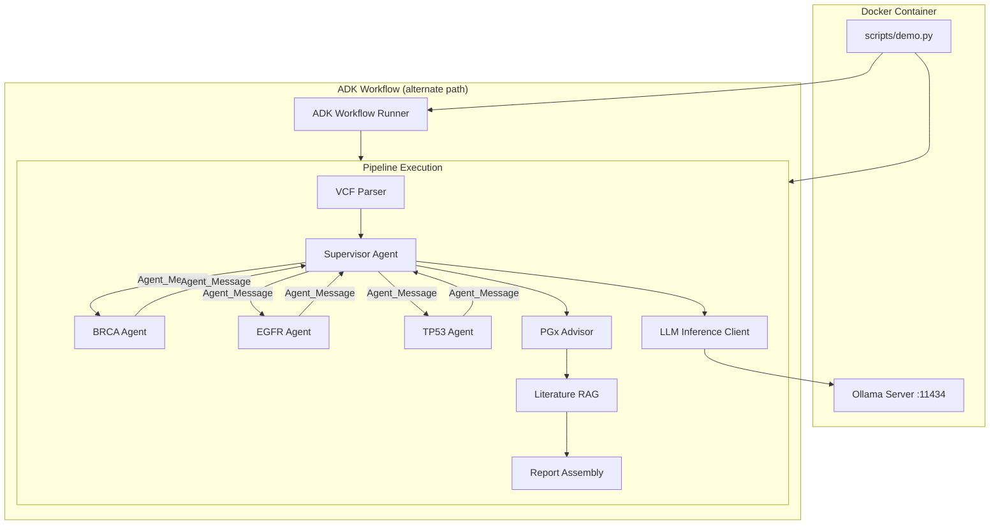

# Design Document: Project Completion Fixes

## Overview

This design addresses five integration gaps in the PharmaGenomics Advisor multi-agent system to bring it from a scaffolded prototype to a genuinely functional multi-agent pipeline. The changes span LLM inference wiring, ADK API compatibility, real agent-to-agent message passing, containerized deployment, and property-based testing for the VCF parser.

The existing codebase already has the correct structural foundations: a `VCFParser` with round-trip support, a `PipelineOrchestrator` with deterministic logic, an `ADKWorkflowRunner` skeleton, agent YAML definitions, and Pydantic data models. The gaps are purely at the integration seam — components are defined but not wired to real inference, real message-passing, or real container execution.

**Design Principles:**
- Minimize changes to existing working code; add new modules alongside existing ones
- Maintain the deterministic fallback path so the system works without Ollama
- Use dependency injection and async interfaces so components are independently testable
- Keep all new Pydantic models in `src/models.py` for single-source-of-truth schema

## Architecture



The architecture introduces three new modules and one new file:
1. `src/inference/ollama_client.py` — LLM inference client wrapping `ollama.chat()`
2. `src/agents/message_bus.py` — Agent message passing with `Agent_Message` model and async dispatch
3. `src/agents/supervisor.py` — Supervisor agent runtime that delegates via message bus
4. `Dockerfile` — Multi-stage build for reproducible deployment

## Components and Interfaces

### 1. LLM Inference Client (`src/inference/ollama_client.py`)

**Responsibility:** Generate clinical narrative text by calling Ollama's chat API.

```python
class LLMInferenceClient:
    """Calls ollama.chat() to produce clinical narrative for classified variants."""

    def __init__(self, model: str | None = None, timeout: float = 30.0):
        """
        Args:
            model: Ollama model name. Defaults to OLLAMA_MODEL env var or "medgemma".
            timeout: HTTP timeout in seconds (default 30s per requirement 1.5).
        """
        ...

    def generate_narrative(self, classification: VariantClassification) -> str:
        """Generate a clinical narrative for a classified variant.

        Args:
            classification: Must have non-empty gene, classification, 
                          evidence_references, and therapeutic_relevance.

        Returns:
            Narrative string (max 2000 chars), or placeholder on failure.

        Behavior:
            - Validates all 4 required fields are present and non-empty
            - If any field missing/empty: returns immediately without calling Ollama
            - Calls ollama.chat() with structured prompt
            - Truncates response to 2000 characters
            - On any error (network, timeout, empty response): logs WARNING and returns placeholder
        """
        ...

    def _build_prompt(self, classification: VariantClassification) -> str:
        """Construct the LLM prompt including gene, classification, evidence, and relevance."""
        ...

    def _placeholder_narrative(self, classification: VariantClassification) -> str:
        """Return fallback text: '{gene} - {classification} - LLM-generated narrative unavailable'"""
        ...
```

**Interface contract:**
- Input: `VariantClassification` with populated gene, classification, evidence_references, therapeutic_relevance
- Output: `str` (max 2000 chars)
- Side effects: HTTP call to Ollama, WARNING-level log on failure
- Timeout: 30 seconds

### 2. Agent Message Bus (`src/agents/message_bus.py`)

**Responsibility:** Typed message-passing between supervisor and specialist agents.

```python
class MessageType(str, Enum):
    CLASSIFY_REQUEST = "CLASSIFY_REQUEST"
    CLASSIFY_RESPONSE = "CLASSIFY_RESPONSE"
    ERROR = "ERROR"

class AgentMessage(BaseModel):
    """Structured payload exchanged between agents at runtime."""
    message_type: MessageType
    sender: str
    recipient: str
    payload: dict
    timestamp: datetime = Field(default_factory=lambda: datetime.now(timezone.utc))

class MessageBus:
    """In-process async message router for agent communication."""

    def register_agent(self, name: str, handler: Callable[[AgentMessage], Awaitable[AgentMessage]]) -> None: ...
    async def dispatch(self, message: AgentMessage, timeout: float = 60.0) -> AgentMessage: ...
    async def dispatch_concurrent(self, messages: list[AgentMessage], timeout: float = 60.0) -> list[AgentMessage]: ...
```

**Design decisions:**
- In-process async routing (no network overhead) — appropriate for single-container deployment
- Pydantic model for message schema validation at boundaries
- 60-second timeout per specialist agent call (requirement 3.2)
- `dispatch_concurrent` uses `asyncio.gather` for parallel specialist invocations (requirement 3.3)

### 3. Supervisor Agent Runtime (`src/agents/supervisor.py`)

**Responsibility:** Receives variant analysis requests, routes to specialist agents via message bus, aggregates results preserving order.

```python
class SupervisorAgent:
    """Runtime supervisor that delegates to specialist agents with real message-passing."""

    def __init__(self, bus: MessageBus, llm_client: LLMInferenceClient, audit_logger: AuditLogger): ...

    async def analyze_variants(self, variants: list[Variant]) -> list[VariantClassification]:
        """
        1. Group variants by gene
        2. Construct AgentMessage for each variant
        3. Dispatch concurrently via MessageBus
        4. On timeout/error: fall back to rule-based classification
        5. Generate clinical narrative via LLMInferenceClient for each classification
        6. Return classifications in original variant order
        """
        ...
```

**Routing logic:**
- `BRCA1`, `BRCA2` → `brca_agent`
- `EGFR` → `egfr_agent`
- `TP53` → `tp53_agent`
- Unknown/missing gene → skip (unrouted)

### 4. Specialist Agent Handlers

Each specialist agent is a function registered on the message bus:

```python
async def brca_handler(msg: AgentMessage) -> AgentMessage:
    """Classify BRCA1/BRCA2 variant using existing rule-based logic."""
    ...

async def egfr_handler(msg: AgentMessage) -> AgentMessage:
    """Classify EGFR variant with TKI sensitivity annotation."""
    ...

async def tp53_handler(msg: AgentMessage) -> AgentMessage:
    """Classify TP53 variant with functional status annotation."""
    ...
```

These handlers wrap the existing `_rule_based_acmg`, `_egfr_therapeutic_relevance`, and `_tp53_functional_status` functions from `orchestrator.py`, providing the message-passing interface on top of proven logic.

### 5. ADK Workflow Runner Fixes (`src/pipeline/adk_workflow.py`)

**Changes needed:**
- Validate all ADK symbols exist before constructing workflow (raise `ADKNotAvailableError` with missing symbol name)
- Use the correct ADK 2.x API (verify `Workflow`, `workflow.START`, `Runner`, `InMemorySessionService` imports)
- Integrate `SupervisorAgent` message-passing into the classify node
- Ensure the final output is always a `ClinicalReport` or raise

### 6. Dockerfile

```dockerfile
# Multi-stage build
FROM python:3.10-slim AS base

# Install system dependencies and Ollama
# Accept OLLAMA_MODEL build arg (default: medgemma)
# Pull model during build

# Runtime stage
# EXPOSE 11434
# Entrypoint: start Ollama, wait up to 30s, run demo.py
```

**Entrypoint script (`scripts/entrypoint.sh`):**
1. Start `ollama serve` in background
2. Poll `http://localhost:11434/api/tags` every 2 seconds, up to 30 seconds
3. If timeout → print error, exit 1
4. Run `python scripts/demo.py --vcf data/samples/sample_variants.vcf --check-ollama`
5. Capture exit code, print markdown report if success, propagate exit code

## Data Models

### New Models (added to `src/models.py`)

```python
class MessageType(str, Enum):
    """Agent message type enum."""
    CLASSIFY_REQUEST = "CLASSIFY_REQUEST"
    CLASSIFY_RESPONSE = "CLASSIFY_RESPONSE"
    ERROR = "ERROR"

class AgentMessage(BaseModel):
    """Structured payload exchanged between Supervisor and Specialist agents."""
    message_type: MessageType
    sender: str = Field(..., description="Agent name of the sender")
    recipient: str = Field(..., description="Agent name of the intended recipient")
    payload: dict = Field(default_factory=dict, description="Message-specific data")
    timestamp: datetime = Field(default_factory=lambda: datetime.now(timezone.utc))
```

### Modified Models

**`VariantClassification`** — add optional field:
```python
clinical_narrative: str = Field(default="", max_length=2000, description="LLM-generated clinical interpretation")
```

**`ClinicalReport`** — no structural changes needed; markdown rendering updated to include clinical narratives.

## Correctness Properties

*A property is a characteristic or behavior that should hold true across all valid executions of a system — essentially, a formal statement about what the system should do. Properties serve as the bridge between human-readable specifications and machine-verifiable correctness guarantees.*

### Property 1: Prompt validation guards LLM calls

*For any* `VariantClassification` object, if any of the four required fields (gene, classification, evidence_references, therapeutic_relevance) is missing or empty, then `generate_narrative()` SHALL NOT invoke `ollama.chat()` and SHALL return without making an HTTP call.

**Validates: Requirements 1.2**

### Property 2: Narrative truncation bound

*For any* non-empty string returned by Ollama (of any length from 1 to arbitrarily large), `generate_narrative()` SHALL return a string of at most 2000 characters.

**Validates: Requirements 1.3**

### Property 3: Clinical narrative inclusion in report

*For any* `ClinicalReport` containing `VariantClassification` objects with non-empty `clinical_narrative` fields, the rendered `markdown_summary` SHALL contain each clinical narrative text.

**Validates: Requirements 1.6**

### Property 4: Gene-based routing correctness

*For any* `Variant` with a gene field matching one of {BRCA1, BRCA2, EGFR, TP53}, the `SupervisorAgent` SHALL construct an `AgentMessage` with `recipient` equal to the correct specialist agent name (`brca_agent` for BRCA1/BRCA2, `egfr_agent` for EGFR, `tp53_agent` for TP53).

**Validates: Requirements 3.1**

### Property 5: Order preservation in aggregation

*For any* list of variants processed by the `SupervisorAgent`, the returned list of `VariantClassification` objects SHALL maintain the same ordering as the input variant list (matched by chromosome, position, ref_allele, alt_allele).

**Validates: Requirements 3.5**

### Property 6: VCF parser round-trip

*For any* valid `Variant` object (with chromosome 1-10 chars, position 1 to 2,147,483,647, alleles from {A,T,C,G,N} of length 1-50, quality 0.0-99999.0, INFO keys/values containing no semicolons or equals signs), calling `format_variant_to_vcf()` then `parse_vcf_line()` SHALL produce a `Variant` with all fields equal to the original.

**Validates: Requirements 5.2**

## Error Handling

### LLM Inference Client
| Error Condition | Handling |
|---|---|
| Ollama unreachable (ConnectionError) | Log WARNING, return placeholder narrative |
| HTTP error (4xx/5xx) | Log WARNING, return placeholder narrative |
| Timeout (>30s) | Log WARNING, return placeholder narrative |
| Empty/whitespace-only response | Log WARNING, return placeholder narrative |
| Missing required fields in classification | Return immediately without calling Ollama (no log needed) |
| OLLAMA_MODEL env var unset/empty | Default to "medgemma" |

### Agent Message Bus
| Error Condition | Handling |
|---|---|
| Specialist agent timeout (>60s) | Return ERROR AgentMessage, supervisor falls back to rule-based |
| Specialist agent raises exception | Catch, wrap in ERROR AgentMessage |
| Unknown recipient | Log WARNING, skip message |

### ADK Workflow Runner
| Error Condition | Handling |
|---|---|
| Missing ADK symbol | Raise `ADKNotAvailableError` with symbol name |
| Workflow completes without ClinicalReport | Raise `ADKNotAvailableError` |
| ADK import fails entirely | Raise `ADKNotAvailableError` |

### Docker Entrypoint
| Error Condition | Handling |
|---|---|
| Ollama fails to start within 30s | Print error, exit code 1 |
| Demo script fails | Propagate non-zero exit code |

## Testing Strategy

### Property-Based Tests (Hypothesis)

The project uses **Hypothesis** (already in dev dependencies) for property-based testing. Each property test runs a minimum of **100 examples** per property.

**Library:** `hypothesis` (version ≥6.100.0, already specified in pyproject.toml)

**Configuration:**
```python
from hypothesis import given, settings, HealthCheck
from hypothesis import strategies as st

@settings(max_examples=100)
```

**Tag format:** Each property test includes a comment referencing the design property:
```python
# Feature: project-completion-fixes, Property 6: VCF parser round-trip
```

**Property tests to implement:**

1. **Property 1 — Prompt validation guards** (`tests/properties/test_llm_inference.py`)
   - Generate random VariantClassification objects with varying field combinations
   - Verify ollama.chat() is never called when fields are missing
   - `# Feature: project-completion-fixes, Property 1: Prompt validation guards LLM calls`

2. **Property 2 — Narrative truncation** (`tests/properties/test_llm_inference.py`)
   - Generate random strings 1-10000 chars, verify output ≤ 2000
   - `# Feature: project-completion-fixes, Property 2: Narrative truncation bound`

3. **Property 3 — Narrative in report** (`tests/properties/test_report_rendering.py`)
   - Generate random ClinicalReports with narratives, verify markdown contains them
   - `# Feature: project-completion-fixes, Property 3: Clinical narrative inclusion in report`

4. **Property 4 — Routing correctness** (`tests/properties/test_agent_routing.py`)
   - Generate random Variants with supported genes, verify correct recipient
   - `# Feature: project-completion-fixes, Property 4: Gene-based routing correctness`

5. **Property 5 — Order preservation** (`tests/properties/test_agent_routing.py`)
   - Generate random variant lists, verify output order matches input order
   - `# Feature: project-completion-fixes, Property 5: Order preservation in aggregation`

6. **Property 6 — VCF round-trip** (`tests/properties/test_vcf_roundtrip.py`)
   - Custom `@composite` strategy generating valid Variant objects
   - `format_variant_to_vcf()` → `parse_vcf_line()` → assert equality
   - `# Feature: project-completion-fixes, Property 6: VCF parser round-trip`
   - Marked with `@pytest.mark.property`
   - Hypothesis shrinking enabled (default — not suppressed)

### Unit Tests (Example-Based)

| Test File | Coverage |
|---|---|
| `tests/unit/test_llm_inference.py` | Fallback scenarios (connection error, HTTP error, timeout, empty response), default model |
| `tests/unit/test_agent_message.py` | AgentMessage model validation, MessageType enum |
| `tests/unit/test_supervisor.py` | Timeout fallback to rule-based, concurrent dispatch behavior |
| `tests/unit/test_adk_workflow.py` | Missing symbol detection, successful report return |

### Integration Tests

| Test File | Coverage |
|---|---|
| `tests/integration/test_adk_runtime.py` | End-to-end ADK workflow with mocked MCP servers (already exists) |
| `tests/integration/test_agent_pipeline.py` | Full supervisor → specialist → narrative pipeline with mocked Ollama |
| `tests/integration/test_docker.py` | Container build and execution (manual/CI only) |

### Test Markers (in `pyproject.toml`)

Already configured:
- `property` — property-based tests (hypothesis)
- `integration` — integration tests requiring Ollama
- `slow` — tests that take >30 seconds
