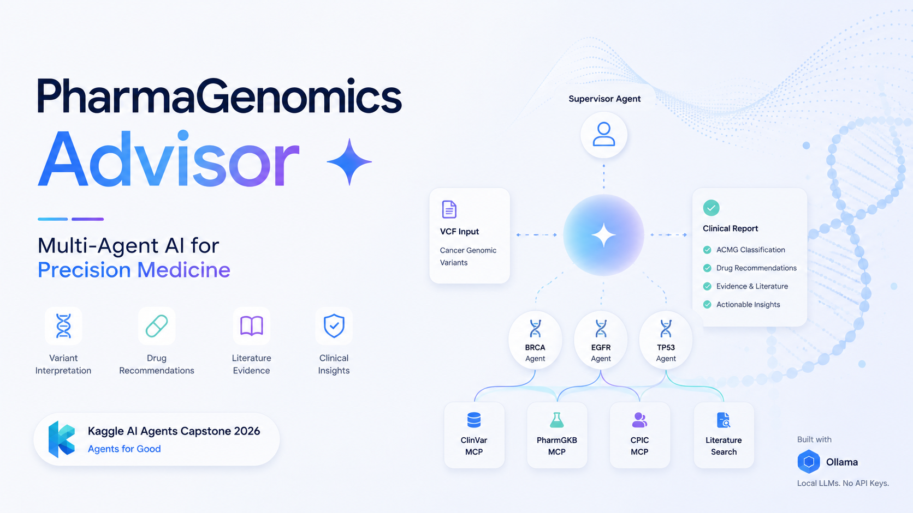

# 🧬 PharmaGenomics Advisor


**Multi-Agent Precision Medicine Pipeline — From Cancer Variants to Drug Recommendations in Minutes**

> AI Agents: Intensive Vibe Coding Capstone Project | Kaggle 2026

[](https://www.python.org/downloads/)
[](https://opensource.org/licenses/MIT)
[]()

---

## What Is This?

PharmaGenomics Advisor is a **multi-agent AI system** that automates cancer genomic variant interpretation and pharmacogenomics drug recommendations. It takes raw VCF (Variant Call Format) files and produces:

1. **ACMG variant classifications** — Pathogenic, Likely Pathogenic, VUS, etc.
2. **Drug recommendations** — Which drugs to use or avoid based on the patient's genetics
3. **Literature evidence** — Published papers supporting each recommendation
4. **Clinical report** — Unified JSON + Markdown + HTML outputs with provenance and actionable warnings

**All running locally. Zero API keys. Zero cloud costs.**

## Why Does This Matter?

Today, interpreting cancer genomic data takes 2-4 weeks and costs $2,000+ per case. Our system reduces interpretation time to minutes while maintaining clinical accuracy — making precision medicine accessible to any hospital, not just major academic centers.

---

## Quick Start

```bash
# Clone
git clone https://github.com/drthgz/pharmagenomics-advisor.git
cd pharmagenomics-advisor

# Setup (installs Ollama + pulls model + installs Python deps)
bash scripts/setup.sh          # Linux/macOS
# powershell scripts/setup.ps1  # Windows

# Run tests
python3 -m pytest tests/unit tests/integration -v

# Run the demo
python3 scripts/demo.py

# Run the same flow via ADK runtime (requires google-adk installed)
python3 scripts/demo.py --runtime adk

# Optional: run storytelling demo with resistant EGFR + unrouted gene
python3 scripts/demo.py --vcf data/samples/sample_variants_storytelling.vcf

# Generate Kaggle-ready media assets (cover + architecture + report preview + thumbnail)
python3 scripts/generate_media_assets.py
```

---

## Architecture

```mermaid
flowchart LR
        VCF[VCF Input] --> PARSE[Parse]
        PARSE --> CLASSIFY[Classify]

        CLASSIFY --> SUPERVISOR[SupervisorAgent]:::agent

        subgraph SPECIALISTS[Parallel Specialist Agents]
                BRCA[BRCA Agent]
                EGFR[EGFR Agent]
                TP53[TP53 Agent]
        end

        SUPERVISOR -->|routes via| MSGBUS[MessageBus]:::agent
        MSGBUS --> BRCA
        MSGBUS --> EGFR
        MSGBUS --> TP53

        BRCA --> CLINVAR[ClinVar MCP]
        EGFR --> CLINVAR
        TP53 --> CLINVAR

        BRCA --> DRUG[Drug Recommendations]
        EGFR --> DRUG
        TP53 --> DRUG

        DRUG --> CPIC[CPIC MCP]
        DRUG --> PHARMGKB[PharmGKB MCP]
        DRUG --> LIT[Literature]
        LIT --> REPORT[Clinical Report]

        LLMCLIENT[LLMInferenceClient]:::infra
        OLLAMA[Ollama Local\nMedGemma / Gemma 4\nNo API Keys]:::infra
        LLMCLIENT --> OLLAMA
        BRCA -.inference.-> LLMCLIENT
        EGFR -.inference.-> LLMCLIENT
        TP53 -.inference.-> LLMCLIENT
        DRUG -.inference.-> LLMCLIENT
        LIT -.inference.-> LLMCLIENT

        classDef infra fill:#143434,stroke:#666,stroke-width:1px;
        classDef agent fill:#364340,stroke:#3399ff,stroke-width:2px;
```



---

## LLM Inference Client

The module `src/inference/ollama_client.py` provides the `LLMInferenceClient` class, which calls the local Ollama server to generate clinical narrative paragraphs for classified genetic variants. Each variant's gene, ACMG classification, evidence references, and therapeutic relevance are assembled into a structured prompt sent via `ollama.chat()`.

**Timeout:** Each request uses a 30-second HTTP timeout (configurable at init). This prevents the pipeline from stalling if Ollama is slow or unresponsive.

**Fallback:** On any failure — network error, timeout, empty response, or unexpected exception — the client logs a warning and returns a placeholder narrative (`"<Gene> - <Classification> - LLM-generated narrative unavailable"`) so the pipeline always completes without crashing.

---

## Multi-Agent Architecture

The system uses a **message-passing architecture** where a central supervisor delegates work to gene-specific specialist agents:

- **SupervisorAgent** (`src/agents/supervisor.py`) — receives variant analysis requests, routes each variant to the appropriate specialist (BRCA, EGFR, TP53) via a gene→agent routing map, and aggregates results. Falls back to rule-based classification if a specialist times out or errors.

- **MessageBus** (`src/agents/message_bus.py`) — async in-process message router. Agents register handlers by name; the bus dispatches `AgentMessage` payloads to the named recipient with configurable timeouts. Supports concurrent fan-out via `dispatch_concurrent` so specialists run in parallel.

- **AgentMessage** (Pydantic model in `src/models.py`) — the structured payload for all agent-to-agent communication. Fields:
  - `message_type` — enum indicating request/response/error
  - `sender` / `recipient` — agent names for routing
  - `payload` — dict carrying variant data or classification results
  - `timestamp` — UTC datetime for audit logging

Communication flow: SupervisorAgent constructs `AgentMessage` objects → MessageBus dispatches to specialists concurrently → specialists return classification responses → SupervisorAgent aggregates and enriches with LLM narratives.

---

## Property-Based Testing

The project uses the [Hypothesis](https://hypothesis.readthedocs.io/) library for property-based testing, complementing traditional unit tests with randomized input exploration.

All property tests live in the `tests/properties/` directory and cover:
- Agent routing correctness for arbitrary gene/variant combinations
- LLM inference client behavior across valid and invalid classifications
- Clinical report rendering for any well-formed `ClinicalReport` instance
- VCF parse/render roundtrip fidelity

Each property runs with a minimum of **100 examples** per invocation (configured via Hypothesis settings), ensuring broad coverage of edge cases that hand-written examples would miss.

Run property tests with: `pytest tests/properties/ -v`

---

## Demo Data

- `data/samples/sample_variants.vcf`: baseline happy path (BRCA1, EGFR L858R, TP53)
- `data/samples/sample_variants_storytelling.vcf`: storytelling path with EGFR T790M (resistant), KRAS unrouted, and BRCA1 actionable continuity

---

## Course Concepts Demonstrated

| Concept | Implementation |
|---------|---------------|
| **Multi-Agent System (ADK)** | Supervisor + 5 specialized agents with graph workflow |
| **Agent Message-Passing** | MessageBus dispatches structured `AgentMessage` payloads between SupervisorAgent and specialists |
| **LLM Inference Integration** | `LLMInferenceClient` generates clinical narratives via local Ollama (MedGemma / Gemma 4) |
| **MCP Servers** | ClinVar, CPIC, PharmGKB tool endpoints |
| **Security Features** | PHI detection, injection prevention, audit logging |
| **Property-Based Testing** | Hypothesis library with 100+ examples per property (`tests/properties/`) |
| **Agent Skills (Agents CLI)** | Project structure, testing, lifecycle management |
| **Deployability** | Docker, docker-compose, setup scripts, zero-dependency demo |

---

## Project Structure

```
pharmagenomics-advisor/
├── agents/                  # Agent definitions (prompts + configs)
│   ├── supervisor/
│   ├── brca_agent/
│   ├── egfr_agent/
│   ├── tp53_agent/
│   ├── pgx_advisor/
│   └── literature_rag/
├── src/                     # Source code
│   ├── models.py           # Pydantic data models
│   ├── exceptions.py       # Custom exception hierarchy
│   ├── parsers/            # VCF file parsing
│   ├── security/           # Security middleware
│   ├── pipeline/           # Graph workflow orchestration
│   ├── rag/                # Literature retrieval
│   └── infrastructure/     # Ollama connectivity
├── mcp_servers/             # MCP server implementations
├── data/                    # Knowledge bases + samples
├── tests/                   # Unit + property + integration tests
├── notebooks/               # Jupyter notebooks for interactive dev
├── docs/                    # Comprehensive documentation
└── scripts/                 # Setup and demo scripts
```

---

## Documentation

| Document | Description |
|----------|------------|
| [01 - Biomedical Foundations](docs/01-biomedical-foundations.md) | DNA, variants, ACMG, pharmacogenomics explained |
| [02 - AI Agents Concepts](docs/02-ai-agents-concepts.md) | LLMs, agents, ADK, MCP, RAG, Ollama |
| [03 - Architecture Overview](docs/03-architecture-overview.md) | System design, data flow, decisions |
| [04 - Implementation Guide](docs/04-implementation-guide.md) | Step-by-step build guide |
| [05 - Deployment Guide](docs/05-deployment-guide.md) | Setup, Docker, Kaggle submission |
| [06 - Debugging Guide](docs/06-debugging-troubleshooting.md) | Troubleshooting every common issue |
| [07 - ADK FAQ](docs/07-adk-faq.md) | Demo-day guidance for ADK runtime, GUI, and API key questions |
| [08 - Kaggle Writeup Draft](docs/08-kaggle-writeup-draft.md) | Ready-to-copy writeup draft for Kaggle submission page |

---

## Requirements

- **Python** 3.10+
- **RAM:** 16 GB minimum
- **GPU:** NVIDIA with 8+ GB VRAM (recommended, not required)
- **Disk:** 10 GB free
- **OS:** Windows 10+, macOS 12+, or Ubuntu 20.04+

---

## Competition Links

- [Capstone Challenge](https://www.kaggle.com/competitions/vibecoding-agents-capstone-project)
- [5-Day Course](https://www.kaggle.com/competitions/5-day-ai-agents-intensive-vibecoding-course-with-google/overview)
- [Prior Work: OffBioMedlines](https://github.com/drthgz/OffBioMedlines)

---

## License

MIT License — see [LICENSE](LICENSE) for details.

---

Built for the Kaggle AI Agents Intensive Vibe Coding Capstone 2026 🧬