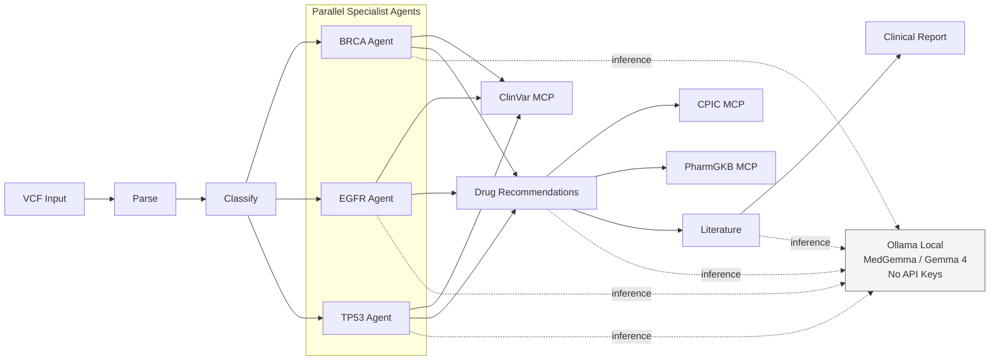
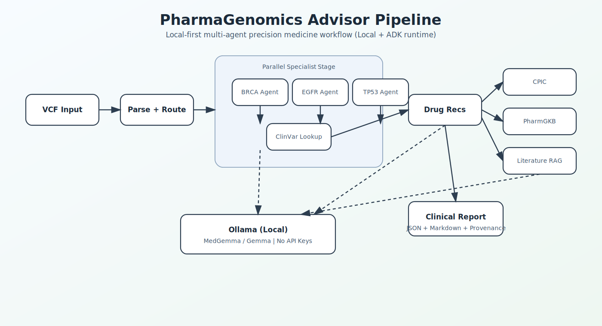
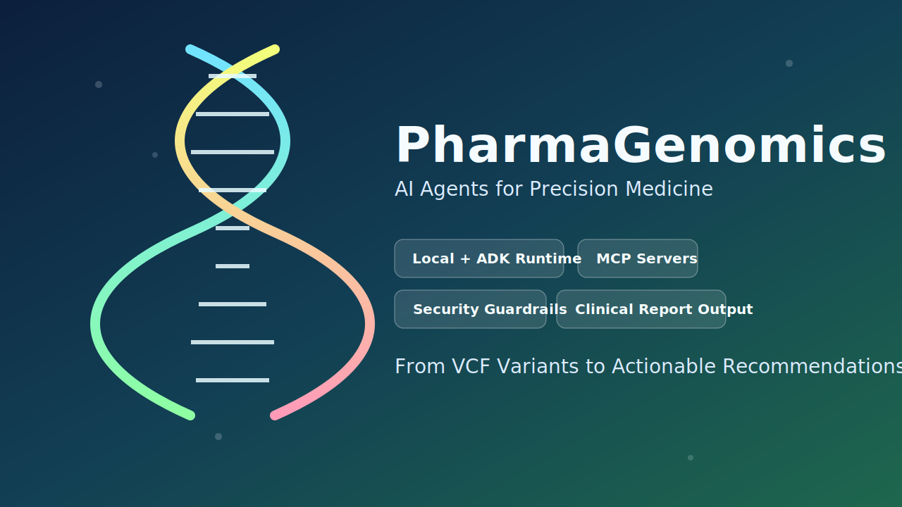

# 🧬 PharmaGenomics Advisor

**Multi-Agent Precision Medicine Pipeline — From Cancer Variants to Drug Recommendations in Minutes**

> AI Agents: Intensive Vibe Coding Capstone Project | Kaggle 2026

[](https://www.python.org/downloads/)
[](https://opensource.org/licenses/MIT)
[]()

---

## What Is This?

PharmaGenomics Advisor is a **multi-agent AI system** that automates cancer genomic variant interpretation and pharmacogenomics drug recommendations. It takes raw VCF (Variant Call Format) files and produces:

1. **ACMG variant classifications** — Pathogenic, Likely Pathogenic, VUS, etc.
2. **Drug recommendations** — Which drugs to use or avoid based on the patient's genetics
3. **Literature evidence** — Published papers supporting each recommendation
4. **Clinical report** — A unified JSON + Markdown document with full provenance

**All running locally. Zero API keys. Zero cloud costs.**

## Why Does This Matter?

Today, interpreting cancer genomic data takes 2-4 weeks and costs $2,000+ per case. Our system reduces interpretation time to minutes while maintaining clinical accuracy — making precision medicine accessible to any hospital, not just major academic centers.

---

## Quick Start

```bash
# Clone
git clone https://github.com/drthgz/pharmagenomics-advisor.git
cd pharmagenomics-advisor

# Setup (installs Ollama + pulls model + installs Python deps)
bash scripts/setup.sh          # Linux/macOS
# powershell scripts/setup.ps1  # Windows

# Run tests
python3 -m pytest tests/unit tests/integration -v

# Run the demo
python3 scripts/demo.py

# Run the same flow via ADK runtime (requires google-adk installed)
python3 scripts/demo.py --runtime adk

# Optional: run storytelling demo with resistant EGFR + unrouted gene
python3 scripts/demo.py --vcf data/samples/sample_variants_storytelling.vcf
```

---

## Architecture



---

## Visual Assets





---

## Demo Data

- `data/samples/sample_variants.vcf`: baseline happy path (BRCA1, EGFR L858R, TP53)
- `data/samples/sample_variants_storytelling.vcf`: storytelling path with EGFR T790M (resistant), KRAS unrouted, and BRCA1 actionable continuity

---

## Course Concepts Demonstrated

| Concept | Implementation |
|---------|---------------|
| **Multi-Agent System (ADK)** | Supervisor + 5 specialized agents with graph workflow |
| **MCP Servers** | ClinVar, CPIC, PharmGKB tool endpoints |
| **Security Features** | PHI detection, injection prevention, audit logging |
| **Agent Skills (Agents CLI)** | Project structure, testing, lifecycle management |
| **Deployability** | Docker, setup scripts, zero-dependency demo |

---

## Project Structure

```
pharmagenomics-advisor/
├── agents/                  # Agent definitions (prompts + configs)
│   ├── supervisor/
│   ├── brca_agent/
│   ├── egfr_agent/
│   ├── tp53_agent/
│   ├── pgx_advisor/
│   └── literature_rag/
├── src/                     # Source code
│   ├── models.py           # Pydantic data models
│   ├── exceptions.py       # Custom exception hierarchy
│   ├── parsers/            # VCF file parsing
│   ├── security/           # Security middleware
│   ├── pipeline/           # Graph workflow orchestration
│   ├── rag/                # Literature retrieval
│   └── infrastructure/     # Ollama connectivity
├── mcp_servers/             # MCP server implementations
├── data/                    # Knowledge bases + samples
├── tests/                   # Unit + property + integration tests
├── notebooks/               # Jupyter notebooks for interactive dev
├── docs/                    # Comprehensive documentation
└── scripts/                 # Setup and demo scripts
```

---

## Documentation

| Document | Description |
|----------|------------|
| [01 - Biomedical Foundations](docs/01-biomedical-foundations.md) | DNA, variants, ACMG, pharmacogenomics explained |
| [02 - AI Agents Concepts](docs/02-ai-agents-concepts.md) | LLMs, agents, ADK, MCP, RAG, Ollama |
| [03 - Architecture Overview](docs/03-architecture-overview.md) | System design, data flow, decisions |
| [04 - Implementation Guide](docs/04-implementation-guide.md) | Step-by-step build guide |
| [05 - Deployment Guide](docs/05-deployment-guide.md) | Setup, Docker, Kaggle submission |
| [06 - Debugging Guide](docs/06-debugging-troubleshooting.md) | Troubleshooting every common issue |
| [07 - ADK FAQ](docs/07-adk-faq.md) | Demo-day guidance for ADK runtime, GUI, and API key questions |
| [08 - Kaggle Writeup Draft](docs/08-kaggle-writeup-draft.md) | Ready-to-copy writeup draft for Kaggle submission page |

---

## Requirements

- **Python** 3.10+
- **RAM:** 16 GB minimum
- **GPU:** NVIDIA with 8+ GB VRAM (recommended, not required)
- **Disk:** 10 GB free
- **OS:** Windows 10+, macOS 12+, or Ubuntu 20.04+

---

## Competition Links

- [Capstone Challenge](https://www.kaggle.com/competitions/vibecoding-agents-capstone-project)
- [5-Day Course](https://www.kaggle.com/competitions/5-day-ai-agents-intensive-vibecoding-course-with-google/overview)
- [Prior Work: OffBioMedlines](https://github.com/drthgz/OffBioMedlines)

---

## License

MIT License — see [LICENSE](LICENSE) for details.

---

Built for the Kaggle AI Agents Intensive Vibe Coding Capstone 2026 🧬